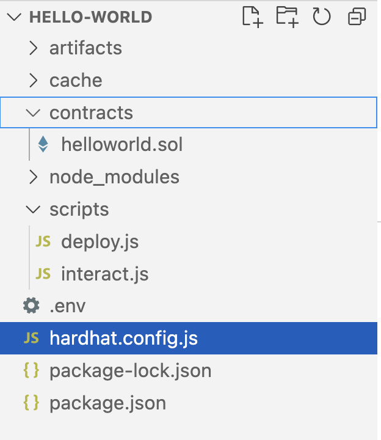
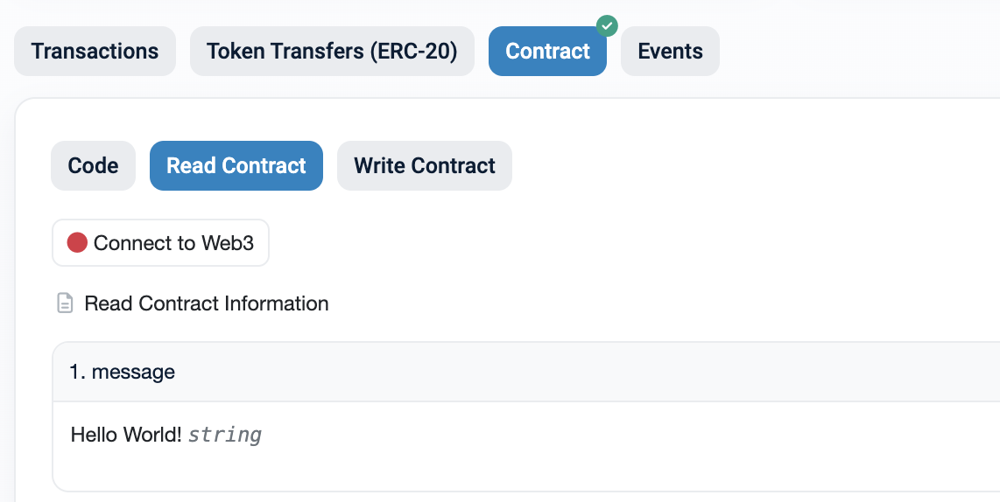
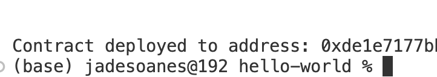
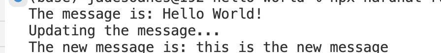

# Hello World! Creating a dApp
Creating a simple 'hello world' decentralised app (dApp) and deploying to the Ethereum blockchain. This project demonstrates the basics of building on the Ethereum blockchain using Hardhat and Solidity. The dApp allows users to send a "Hello World" message to the blockchain and practice writing a smart contract!


## Features 📝
- **Smart Contract:** A basic Solidity contract that stores and retrieves a "Hello World" message.
- **Deployment:** Scripts for deploying the contract using Hardhat.
- **Test Net:** Development done using the Sepolia test network.

## Installation 🧰

### Prerequisites
- [Node.js](https://nodejs.org/) (v14 or later)
- [npm](https://www.npmjs.com/) 
- Ethereum wallet
- [Alchemy account](https://www.alchemy.com/)


### Clone the repository
```bash
git clone https://github.com/yourusername/helloworld-dapp.git
cd helloworld-dapp
```

### Ensure you have the correct file structure
It is important you have the correct file structure! Especially the placement of the .env file



### Note: keys!
Not included in this repo is the .env file in which I set the variables 'API_URL' and 'PRIVATE_KEY'. You will ahve to follow the guidence in the tutorial below for more information on where to get these.


### Refer to this tutorial
[Ethereum Tutorial](https://ethereum.org/en/developers/tutorials/hello-world-smart-contract/)


## The result - PART 1 ❗
The contract I ran in this project was successful, as evidenced by this little 'Hello World!' which can be found on the block explorer!

**Screenshot 1: Block Explorer**




**Screenshot 2: Response from terminal**



## The result - PART 2 ❗
The second part of the tutorial was interacting with the contract! In this part the message 'Hello World!' was updated.




## References & credit 🌟
I completed the below tutorial from ethereum.org - thank you to that community for making this information freely available.

https://ethereum.org/en/developers/tutorials/hello-world-smart-contract/


https://docs.alchemy.com/docs/interacting-with-a-smart-contract


